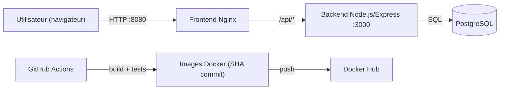

# VitalSync - Chaîne CI/CD conteneurisée

## Description du projet
VitalSync est une application de suivi médical et sportif structurée en trois services:
- un back-end Node.js/Express qui expose une API REST sur le port 3000;
- un front-end statique servi par Nginx sur le port 80 (exposé en local sur 8080);
- une base de données PostgreSQL.

Le projet met l'accent sur l'intégration et le déploiement continus: tests, build d'images Docker, push registry, déploiement de staging et contrôle de santé automatique.

## Architecture du projet
```
vitalsync/
├── backend/                      # API Node.js + tests Jest + Dockerfile
├── frontend/                     # index.html + nginx.conf + Dockerfile
├── k8s/                          # manifestes Kubernetes (Deployment, Service, Ingress, Secret)
├── docker-compose.yml            # orchestration locale des 3 services
└── .github/workflows/ci-cd.yml   # pipeline GitHub Actions
```

## Prérequis (local)
- Git 2.40+
- Docker Desktop 4.x (Docker Engine + Docker Compose v2)
- Compte Docker Hub (pour le push d'images depuis la CI)
- Optionnel: Node.js 22+ pour lancer lint/tests en local sans Docker

## Lancement en local avec Docker Compose
1. Créer un fichier `.env` à partir de `.env.example`.
2. Vérifier les valeurs des variables (ports, identifiants DB).
3. Démarrer les services:

```bash
docker compose up --build -d
```

4. Vérifier l'état:

```bash
docker ps
```

5. Tester l'API:

```bash
curl http://localhost:3000/health
```

6. Accéder au front:

```text
http://localhost:8080
```

7. Arrêter les services:

```bash
docker compose down
```

Si le port 5432 est déjà pris sur la machine, il suffit de changer `POSTGRES_PORT` dans `.env` (par exemple `5433`).

## Variables d'environnement
Le projet utilise un fichier `.env` non versionné et un `.env.example` versionné.

Variables utilisées:
- `POSTGRES_DB`: nom de la base de données PostgreSQL.
- `POSTGRES_USER`: utilisateur PostgreSQL.
- `POSTGRES_PASSWORD`: mot de passe PostgreSQL.
- `POSTGRES_PORT`: port PostgreSQL exposé sur l'hôte.
- `NODE_ENV`: mode d'exécution du back-end.
- `BACKEND_PORT`: port hôte du back-end (conteneur 3000).
- `FRONTEND_PORT`: port hôte du front-end (conteneur 80).

## Fonctionnement de la pipeline CI/CD
La pipeline est définie dans `.github/workflows/ci-cd.yml` et se déclenche:
- à chaque `push` sur `develop`;
- à chaque `pull_request` vers `main`.

Elle contient trois jobs:
- `Lint et tests`: installation des dépendances back-end, exécution ESLint, exécution Jest.
- `Build Docker et push registry`: build des images backend/frontend, tag par SHA du commit, login Docker Hub puis push des images.
- `Déploiement staging et health check`: déploiement via Docker Compose, test de santé sur `/health`, échec de pipeline si le service ne répond pas.

## Choix techniques et justifications
Le back-end est conteneurisé avec un Dockerfile multi-stage pour séparer la phase de test de la phase d'exécution, ce qui garde une image de production plus légère et plus sûre. Le front-end utilise Nginx car il est simple et fiable pour servir des fichiers statiques et faire un reverse proxy vers l'API. PostgreSQL est utilisé via l'image officielle alpine, avec un volume persistant pour conserver les données entre redémarrages. Docker Compose permet de lancer l'ensemble rapidement en local, avec un réseau dédié pour isoler les conteneurs du projet. GitHub Actions a été retenu car le dépôt est sur GitHub et l'intégration est directe. Le tag d'image basé sur le SHA est utilisé pour garder une correspondance claire entre image et commit, ce qui simplifie le suivi et les retours arrière.

## Schéma d'architecture (Mermaid)


## Secrets CI (GitHub Actions)
Secrets requis dans le dépôt:
- `DOCKERHUB_USERNAME`
- `DOCKERHUB_TOKEN`

Ces secrets sont utilisés pour s'authentifier au registry sans exposer d'identifiants dans le code.
