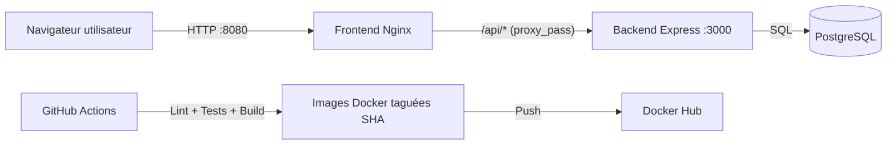

# VitalSync - Documentation technique

## 1. Objet du projet
VitalSync est un projet de mise en place d'une chaîne d'intégration et de déploiement continus pour une application web de suivi médical et sportif.  
L'application est composée d'un front-end statique, d'une API Node.js/Express et d'une base PostgreSQL.

## 2. Architecture applicative
### 2.1 Composants
- `frontend` : page statique servie par Nginx.
- `backend` : API REST Express exposée sur le port interne `3000`.
- `database` : PostgreSQL via image officielle.

### 2.2 Structure du dépôt
```text
vitalsync/
├── backend/
│   ├── Dockerfile
│   ├── package.json
│   ├── server.js
│   └── test/
├── frontend/
│   ├── Dockerfile
│   ├── index.html
│   └── nginx.conf
├── k8s/
│   ├── backend-deployment.yaml
│   ├── backend-service.yaml
│   ├── db-secret.yaml
│   ├── frontend-deployment.yaml
│   ├── frontend-service.yaml
│   └── frontend-ingress.yaml
├── .github/workflows/ci-cd.yml
└── docker-compose.yml
```

### 2.3 Schéma d'architecture


## 3. Prérequis d'exécution locale
- Git `>= 2.40`
- Docker Desktop `>= 4.x` (Docker Engine + Compose v2)
- Compte Docker Hub (pour la CI)
- Node.js `22` recommandé pour exécuter lint/tests localement

## 4. Configuration locale
Créer un fichier `.env` à la racine (ne pas le versionner) en partant de `.env.example`.

Exemple de variables attendues :
```env
POSTGRES_DB=vitalsync
POSTGRES_USER=vitalsync_user
POSTGRES_PASSWORD=<mot_de_passe>
POSTGRES_PORT=5433
NODE_ENV=production
BACKEND_PORT=3000
FRONTEND_PORT=8080
```

Si le port `5432` est déjà utilisé sur la machine, définir `POSTGRES_PORT=5433` (ou un autre port libre).

## 5. Exécution avec Docker Compose
### 5.1 Démarrage
```bash
docker compose up --build -d
```

### 5.2 Vérification des services
```bash
docker ps
```

### 5.3 Vérification santé API
```bash
curl http://localhost:3000/health
```

### 5.4 Accès front-end
```text
http://localhost:8080
```

### 5.5 Arrêt
```bash
docker compose down
```

## 6. Pipeline CI/CD (GitHub Actions)
Fichier : `.github/workflows/ci-cd.yml`

### 6.1 Déclencheurs
- `push` sur la branche `develop`
- `pull_request` vers la branche `main`

### 6.2 Étapes exécutées
1. **Lint et tests**  
   Installation des dépendances du back-end, exécution ESLint, puis tests Jest.
2. **Build Docker et push registry**  
   Build des images backend/frontend, tag avec le SHA de commit, login Docker Hub, push des images.
3. **Déploiement staging et health check**  
   Démarrage des services via Docker Compose, vérification de `http://localhost:3000/health`, échec du job si la route ne répond pas.

### 6.3 Secrets requis
- `DOCKERHUB_USERNAME`
- `DOCKERHUB_TOKEN`

Ces secrets sont stockés dans GitHub Actions pour éviter de placer des identifiants en clair dans le dépôt.

## 7. Choix techniques et justifications
Le back-end utilise un Dockerfile multi-stage pour séparer la phase de validation (tests) et la phase d'exécution. Ce choix réduit la taille de l'image finale et limite les dépendances inutiles en production.  
Le front-end est servi par Nginx, car il répond bien à un besoin de contenu statique et de reverse proxy vers le back-end via `/api/*`.  
PostgreSQL est déployé avec un volume persistant pour conserver les données entre redémarrages de conteneurs.  
Le réseau Docker dédié (`bridge`) isole les services VitalSync du reste des conteneurs locaux.  
GitHub Actions est retenu car le dépôt est sur GitHub et permet une intégration directe des jobs CI/CD.  
Le tag d'image basé sur le SHA du commit assure la traçabilité exacte entre code source et image déployée, contrairement à un tag générique `latest`.

## 8. Référence Kubernetes (partie orchestration)
Le dossier `k8s/` contient les manifestes de référence :
- Deployment backend (2 réplicas + liveness probe)
- Service backend (ClusterIP)
- Deployment/Service frontend
- Ingress frontend
- Secret pour le mot de passe base de données
